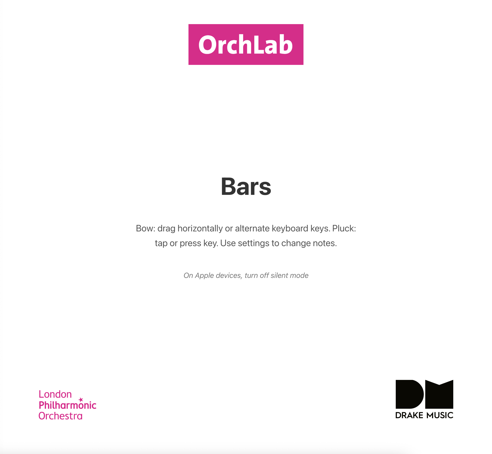
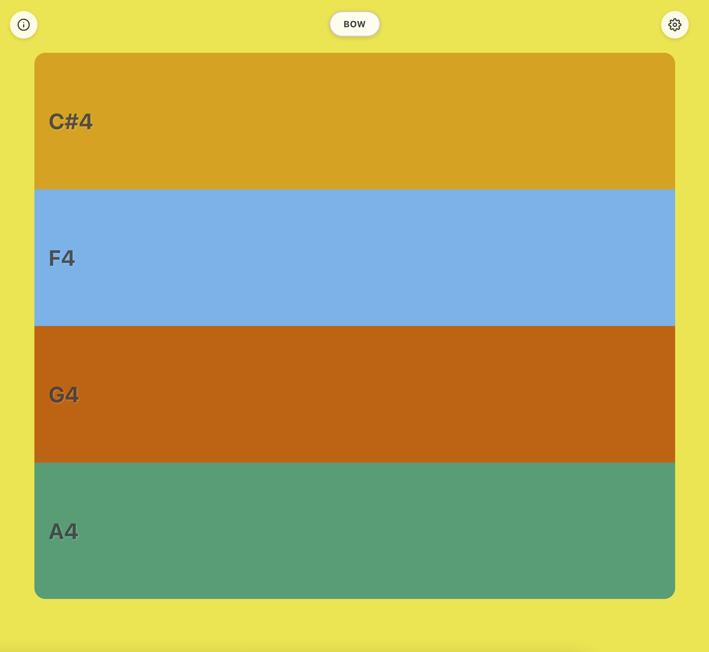
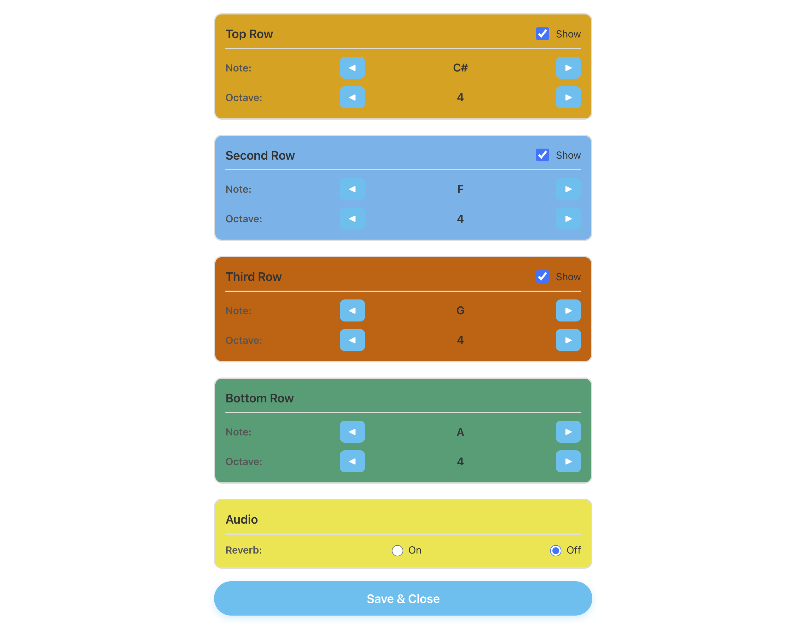
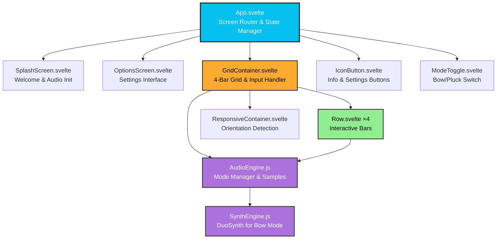

# Bars - Bowed & Plucked String Instrument

A responsive web-based musical instrument that transforms your screen into 4 playable horizontal bars. Each bar represents a different note, playable through intuitive bowing gestures or plucked notes, with both touch/mouse and keyboard controls.

## Features

- **Dual Playing Modes**:
  - **Bow Mode**: Drag horizontally across bars for velocity-sensitive bowing (faster = louder)
  - **Pluck Mode**: Tap or click for sampled cello plucks
- **4 Configurable Rows**: Each bar can be set to any note across 4 octaves (2-5)
- **Show/Hide Rows**: Customize your layout by hiding up to 2 rows
- **Responsive Design**: Adapts seamlessly to portrait and landscape orientations
- **Multiple Input Methods**:
  - Touch/drag gestures on mobile devices
  - Mouse dragging on desktop
  - Keyboard controls with bowing simulation (rapid key alternation)
- **iOS 12+ Compatible**: Extensively tested and optimized for older iOS devices including iPad Air 1
- **Persistent Settings**: Your note configurations and audio preferences are saved locally

## Usage

### 1. **Launch**: Click/tap anywhere on the splash screen to begin or press any key on the keyboard.



### 2. **Play**: 

**Bow Mode (Default)**:
- **Touch/Mouse**: Drag horizontally across a bar - speed of movement controls volume
- **Keyboard**: Rapidly alternate between adjacent keys on the same row (e.g., Q-W-Q-W-Q-W) - faster alternation = louder sound
  - Single keypress = short quiet note
  - Fast alternation = sustained loud sound (like the Daley Thompson running mechanic!)

**Pluck Mode**:
- **Touch/Mouse**: Single tap triggers a plucked cello note
- **Keyboard**: Single keypress triggers a plucked note

**Keyboard Layout**:
- **Top Row**: 1, 2, 3, 4, 5, 6, 7, 8, 9, 0, -, =
- **Second Row**: Q, W, E, R, T, Y, U, I, O, P, [, ]
- **Third Row**: A, S, D, F, G, H, J, K, L, ;, '
- **Bottom Row**: Z, X, C, V, B, N, M, ,, ., /
- **Escape**: Panic stop (stops all notes immediately)



### 3. **Toggle Mode**: 
- Tap the BOW/PLUCK button at the top center to switch between playing modes

### 4. **Configure**: 
- Tap the settings icon (⚙️) to change notes, octaves, or toggle reverb
- Tap the info icon (ℹ️) to view instructions again



## How It Works

**Bow Mode**: Uses a custom DuoSynth engine (dual oscillators: square + sawtooth) with vibrato, chorus, and envelope filtering. Movement speed is tracked and mapped to volume in real-time, creating expressive, violin-like dynamics.

**Pluck Mode**: Uses Web Audio API sample playback with pitch-shifting. Two cello samples (B2 and B4) are loaded and pitch-shifted to cover the full range of playable notes.

**Gesture Tracking**: Horizontal movement is measured in viewport-width units to ensure consistent behavior across all screen sizes. Velocity smoothing prevents jittery volume changes while maintaining responsiveness.

**Keyboard Bowing**: Tracks time between key alternations to simulate bowing motion - rapid alternation builds velocity while pausing causes natural decay.

## Development

### Prerequisites

- Node.js (v14 or higher)
- npm or pnpm

### Installation
```bash
# Clone the repository
git clone https://github.com/gawainhewitt/soundmakers_bars.git
cd bars

# Install dependencies
npm install

# Start development server
npm run dev
```

Visit `http://localhost:5173` in your browser.

### Building for Production
```bash
# Build the app
npm run build

# Preview the production build
npm run preview
```

The built files will be in the `dist/` directory, ready for deployment.

### Testing on Mobile Devices

To test the production build on physical mobile devices (especially useful for iOS testing):
```bash
# Build the app first
npm run build

# Serve the production build on your local network
npm run serve
```

The app will be available at your local IP address (e.g., `http://192.168.1.x:3000`). You can access this URL from any device on the same network.

**Note**: This is particularly important for testing iOS-specific features like audio initialization and touch handling, which behave differently in development vs production builds.

## iOS Compatibility Notes

This app has been carefully optimized for iOS 12+ devices, including iPad Air 1:

- **Polyfills**: Core-js and regenerator-runtime ensure ES6+ features work on older browsers
- **Audio Performance**: Web Audio API implementation chosen over Tone.js for better performance on legacy hardware
- **Touch Handling**: Viewport-relative movement tracking ensures consistent gesture response across all screen sizes
- **Viewport Management**: Comprehensive fixes for iOS viewport issues when switching apps
- **Zoom Prevention**: Disables pinch-zoom and double-tap-zoom for a native app feel
- **Audio Optimization**: Samples converted to 96kbps mono for optimal performance on older devices

## Project Structure
```
├── src/
│   ├── App.svelte              # Main app component & screen routing
│   ├── main.js                 # Entry point with iOS fixes
│   ├── app.css                 # Global styles
│   └── lib/
│       ├── AudioEngine.js      # Audio mode management & sample playback
│       ├── SynthEngine.js      # DuoSynth for bow mode
│       ├── Row.svelte          # Individual playable bar
│       ├── GridContainer.svelte # 4-bar layout & keyboard handling
│       ├── OptionsScreen.svelte # Settings interface
│       ├── ModeToggle.svelte   # Bow/Pluck mode switcher
│       ├── SplashScreen.svelte # Welcome/instructions screen
│       ├── IconButton.svelte   # Reusable icon button component
│       └── ResponsiveContainer.svelte # Orientation handling
├── public/
│   ├── images/                 # Logos and icons
│   ├── sounds/                 # Cello samples for pluck mode
│   └── polyfills/              # iOS 12+ compatibility scripts
└── index.html                  # Entry HTML with polyfill loading
```

## Architecture


*Component hierarchy and data flow*

## Technologies Used

- **Svelte 5**: Modern, reactive UI framework with runes
- **Vite**: Fast build tool and dev server
- **Web Audio API**: Real-time synthesis and sample playback
- **Vite Legacy Plugin**: Automatic transpilation and polyfills for older browsers

### Design Decisions

**Static Site Delivery**: This app is built as a static site (vanilla Vite + Svelte) rather than using SvelteKit. This architectural choice provides:

- **Maximum Compatibility**: Works seamlessly on older devices and browsers (iOS 12+)
- **Lightweight Bundle**: Minimal JavaScript footprint for faster loading on slower devices
- **Simple Deployment**: Can be deployed to any static hosting service without server-side requirements
- **Reduced Complexity**: No SSR overhead or routing complexity for a single-page application

**Web Audio Over Libraries**: Direct Web Audio API implementation provides significantly better performance on legacy iOS hardware compared to higher-level libraries like Tone.js, with more control over audio routing and processing.

**Viewport-Relative Gestures**: Movement tracking in viewport width units (vw) rather than pixels ensures consistent playability across all screen sizes, from iPhone to desktop.

This approach prioritizes accessibility, expressiveness, and performance, ensuring the app works reliably across the widest possible range of devices.

## Troubleshooting

**No sound on iOS**: Ensure silent mode is turned off. The audio context requires an initial user interaction (handled by the splash screen).

**Bowing not responsive**: Try increasing movement speed or ensure you're dragging horizontally. On keyboard, alternate between adjacent keys more rapidly.

**Notes hang after keyboard use**: Press Escape for panic stop, or switch away from and back to the browser window (automatic cleanup).

**Layout issues after app switching**: The app includes comprehensive viewport reset logic that should handle this automatically.

## Contributing

Contributions are welcome! Please feel free to submit a Pull Request.

## License

See [LICENSE](LICENSE) file for details.

## Credits

Developed in collaboration with:
- [**OrchLab**](https://orchlab.org/)
- [**London Philharmonic Orchestra (LPO)**](https://lpo.org.uk/)
- [**Drake Music**](https://www.drakemusic.org/)
- [**Gawain Hewitt**](https://gawainhewitt.co.uk/)